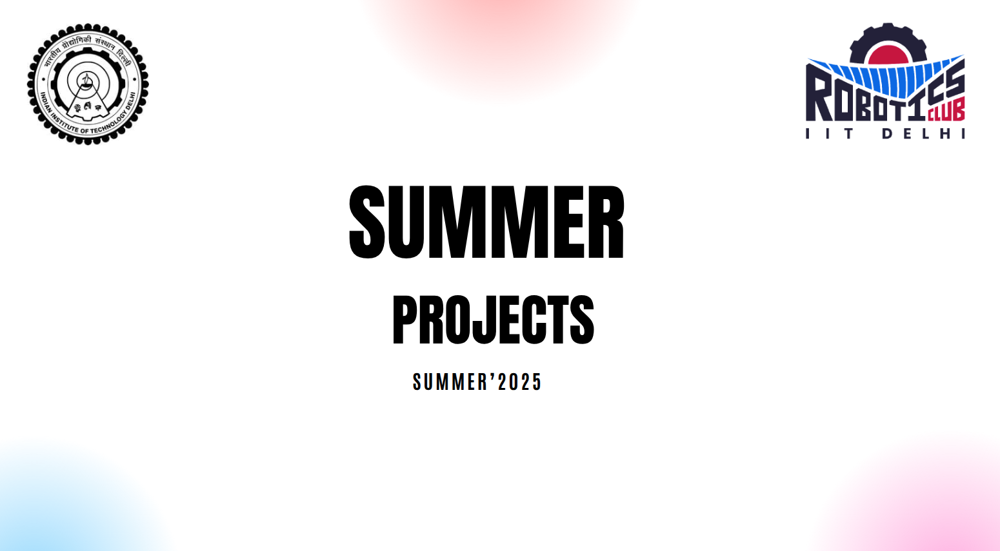

# Robotics Summer Project 2025-26

  
  
  
  

    
     
    </h1>Add project specific image on ./photos/foto_1.png</h1> 
  

## 🤖 Project Overview - WASP (Wireless and Similitude Positioning System)

The aim of this project is to make a bot that would identify its location in space with respect to the accessing points using an ESP-8266 WI-FI module, and the bot would then traverse to the required location in an obstruction-free space as per the input location of the user, using method of trilateration, and algorithms like kalman filter.

# 📚 Theory:

- [Kalman Filter](https://en.wikipedia.org/wiki/Kalman_filter)
- [ESP 8266 AT Firmware](https://www.espressif.com/en/support/download/at)
- _For rest of the theory and documentation, refer to [resources subfolder](https://github.com/RoboticsClubIITDelhi/WASP/tree/main/resources)_

### 🎯 Design Goals
# CAD
-  Design an ESP-controlled differential car.

# Wifi and Access Point Setup
-  Try and test 4 ESP 8266 wifi modules and capture the data for the arena with signal strength

# Electronics and PCB designing :
-  Design PCB - Access point PCB with case
-  IMU Calibration using magnetometer

# Programming:
-  Programming a Kalman filter to fuse the data of the IMU and the WIFI positioning system.

## 🧠 Algorithm Development
!ToDo()

## ⏱️ Project Timeline
Main idea is to build a very very basic version first, probably within 2 weeks and then work on modifying it

### Week 1: Introduction
-  Review the project documentations
-  Be familiar with github
-  Brainstorm ideas and design concepts based on the project 
-  Prepare Bill of Materials
-  Draft electronic system diagram, CAD and PCB for access points

### Week 2: Hardware Assembly
-  Assemble components to make a rudimentary bot
-  Assemble rudimentary wifi access points

### Week 3: Programming wifi access points
-  Programming using usb to uart converter
-  Debugging esp8266 board issues while uploading code (* more on it in #issues section)

### Week 4: Making all access points and Central Bot programming
-  All 4 access points by designing our own PCB on perf boards
-  Made functions in central bot to read RSSI data of all the wifi access points

### Weeks 5-7: Progressive Enhancements in central bot code
- Implemented Functions to get distance from measured RSSI values on a separate module
- Calibrated the function by testing at various distances to accurately get the calibrated coefficents 
- Merged these functions into the exiisting central bot code
- Tested out kalman filter functions and added that into our Central bot code
- further debugging and refinements

### Weeks 8-9: Hardware improvements and locomotion
- Refined access point circuits
- Refined central bot chassis
- added controls to run the bot via buttons on a self-hosted website
- added a button to get cordinates of bot on the website

## 📚 Resources and references

- for installations guides and issues, refer to instructions.txt files in the relevant folders/subfolders
- for other resources, refer to [resources subfolder](https://github.com/RoboticsClubIITDelhi/WASP/tree/main/resources)

### Development Software
- [Arduino IDE](https://www.arduino.cc/en/software/)
- [Autodesk Inventor](https://www.autodesk.com/in/products/inventor/overview)
- [EasyEDA](https://easyeda.com/)

## 🤝 Contributor Notes
- We follow the [standard Git workflow](https://www.geeksforgeeks.org/git-workflows-with-open-source-collaboration/) for collaboration
- Suggestions for improvement are welcome via **Issues** or Discussions.

---

